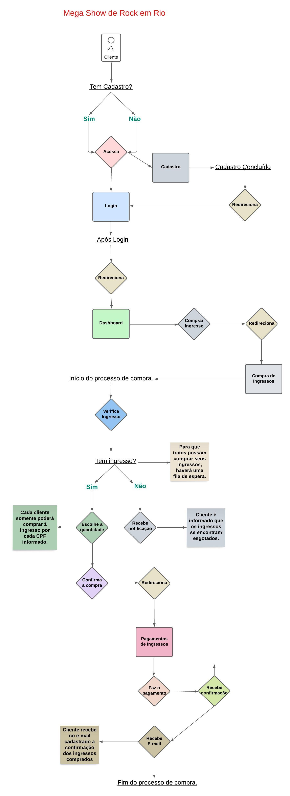

<h1 align="center" font-family="pattaya">Arquitetura do projeto Mega Show de Rock em Rio</h1> 
<h2 font-family="pattaya">Desafio técnico - BigDataCorp</h2>

<h2 font-family="pattaya">Descrição</h2> 

A imagem abaixo fará referência ao projeto Mega Show Rock em Rio, onde os clientes poderão ter acesso à uma aplicação de compra de ingressos.

 

<h2 font-family="pattaya">Composição Páginas</h2> 
- Login;  
- Cadastro;  
- Dashboard;  
- Compra de Ingressos;  
- Pagamentos de Ingressos. 

<h2 font-family="pattaya">Arquitetura do Projeto</h2> 

<h2 font-family="pattaya">Regras de Negócio</h2> 
- Haverá uma fila de espera para a compra de ingressos. Enquanto um cliente inicia o processo de compra, o próximo deverá aguardar a sua liberação para acesso à página de compras. 
- O Cliente somente poderá comprar 1 ingresso por cada CPF informado. 
- Caso não haja ingresso disponível, o cliente será notificado na página que não é possível realizar a compra de ingressos, pois estão esgotados. 
- Após a confirmção da compra dos ingressos na página de pagamentos, o Cliente receberá no seu e-mail cadastrado a confirmação dos ingressos comprados. 
